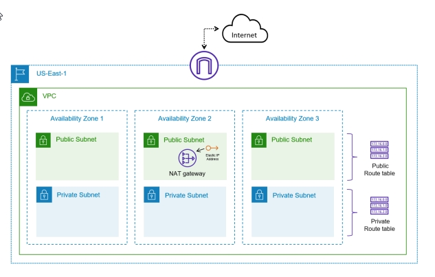

# Lab Instruction

## Create six subnets, Internet Gateway, NAT Gateway, route tables:

### Task 1: Create a new VPC in your account in the US-East-1 region

### Task 2: Create public and private subnets in three different Availability Zones

### Task 3: Deploy an Internet Gateway and attach it to the VPC

### Task 4: Provision a NAT Gateway (a single instance will do) for outbound connectivity

### Task 5: Ensure that route tables are configured to properly route traffic based on the requirements

### Task 6: Delete the VPC resources

### Task 7: Prepare files and credentials for using Terraform to deploy cloud resources

### Task 8: Set credentials for Terraform deployment

### Task 9: Deploy the AWS infrastructure using Terraform
